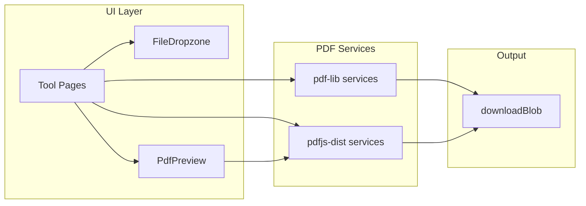
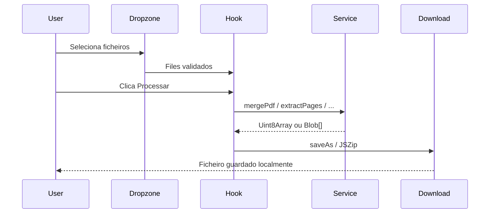

# Plano: PdfTools — Aplicação React de Ferramentas PDF (Client-Side)

## Contexto

A pasta [`c:\CursorApps\PdfTools`](c:\CursorApps\PdfTools) está vazia. O objetivo é uma SPA onde **nenhum ficheiro sai do browser** — todo o processamento ocorre em memória com download local do resultado.

---

## Stack recomendada

### Build e runtime

| Ferramenta | Papel | Porquê |
|---|---|---|
| **Vite 6** + `@vitejs/plugin-react` | Build/dev | Arranque rápido, HMR excelente, tree-shaking nativo, ideal para libs pesadas como PDF.js |
| **TypeScript 5.x** | Tipagem | Segurança em APIs assíncronas e buffers (`Uint8Array`, `ArrayBuffer`) |
| **React 19** + **React Router 7** | UI + rotas | Uma rota por ferramenta, lazy loading por feature |

Alternativas descartadas para este caso:
- **Next.js** — desnecessário (sem SSR/API routes; tudo é client-side)
- **Create React App** — deprecated
- **Parcel** — viável, mas ecossistema Vite + React é mais maduro

### Bibliotecas PDF

| Biblioteca | Uso | Não usar para |
|---|---|---|
| **[pdf-lib](https://pdf-lib.js.org/)** | Merge, split/extract pages, images→PDF, metadados, download | Renderizar páginas, extrair texto |
| **[pdfjs-dist](https://www.npmjs.com/package/pdfjs-dist)** (Mozilla PDF.js) | Pré-visualização, thumbnails, render canvas, extrair imagens embutidas | Criar/modificar estrutura PDF |
| **[react-pdf](https://github.com/wojtekmaj/react-pdf)** (opcional) | Componente `<Document>` / `<Page>` para preview | Lógica de processamento (usar serviços dedicados) |

**Divisão de responsabilidades** (padrão usado por ferramentas similares):



- **Merge / Split / Images→PDF** → `pdf-lib` exclusivamente
- **Extract Images** → `pdfjs-dist` (operadores `paintImageXObject`) com fallback render-to-canvas
- **Preview/thumbnails** → `react-pdf` ou wrapper fino sobre `pdfjs-dist`

### Bibliotecas de suporte

| Biblioteca | Uso |
|---|---|
| **react-dropzone** | Drag & drop de ficheiros |
| **file-saver** | `saveAs()` cross-browser para blobs |
| **zustand** (opcional) | Estado global leve (fila de ficheiros, progresso) |
| **Tailwind CSS 4** + **clsx** | UI consistente e rápida de construir |
| **@radix-ui/react-*`** ou **shadcn/ui** | Componentes acessíveis (Dialog, Progress, Tabs) |

### Worker e assets PDF.js

Configurar em [`vite.config.ts`](vite.config.ts):
- Copiar worker: `pdfjs-dist/build/pdf.worker.min.mjs` via `?url` import
- `standardFontDataUrl` e `cMapUrl` apontando para `node_modules/pdfjs-dist/`

Isto evita erros comuns de fontes/CMaps em preview e extração.

---

## Estrutura de pastas proposta

```
PdfTools/
├── public/
│   └── favicon.svg
├── src/
│   ├── app/                          # Bootstrap da aplicação
│   │   ├── App.tsx
│   │   ├── router.tsx                # Rotas lazy-loaded
│   │   └── providers.tsx             # Theme, toast, etc.
│   │
│   ├── features/                     # Uma pasta por ferramenta (vertical slices)
│   │   ├── merge/
│   │   │   ├── MergePage.tsx
│   │   │   ├── useMergePdf.ts        # Hook com lógica UI + chamada ao serviço
│   │   │   └── merge.types.ts
│   │   ├── extract-pages/
│   │   │   ├── ExtractPagesPage.tsx
│   │   │   ├── PageSelector.tsx      # UI seleção de páginas
│   │   │   └── useExtractPages.ts
│   │   ├── extract-images/
│   │   │   ├── ExtractImagesPage.tsx
│   │   │   └── useExtractImages.ts
│   │   └── images-to-pdf/
│   │       ├── ImagesToPdfPage.tsx
│   │       └── useImagesToPdf.ts
│   │
│   ├── shared/
│   │   ├── components/               # UI reutilizável
│   │   │   ├── layout/
│   │   │   │   ├── AppShell.tsx
│   │   │   │   ├── Header.tsx
│   │   │   │   └── ToolCard.tsx      # Card na home
│   │   │   ├── pdf/
│   │   │   │   ├── FileDropzone.tsx
│   │   │   │   ├── PdfPreview.tsx    # react-pdf wrapper
│   │   │   │   ├── PageThumbnail.tsx
│   │   │   │   └── ProcessingOverlay.tsx
│   │   │   └── ui/                   # Button, Progress, Alert (shadcn)
│   │   │
│   │   ├── hooks/
│   │   │   ├── useFileReader.ts      # File → ArrayBuffer
│   │   │   ├── useDownload.ts        # Blob → save
│   │   │   └── useAsyncTask.ts       # loading/error/progress pattern
│   │   │
│   │   ├── lib/
│   │   │   ├── pdf/
│   │   │   │   ├── pdfLibClient.ts   # Singleton/config pdf-lib
│   │   │   │   ├── pdfJsClient.ts    # init pdfjs worker + getDocument
│   │   │   │   ├── mergePdf.ts       # mergePdf(files[]): Uint8Array
│   │   │   │   ├── extractPages.ts   # extractPages(pdf, indices)
│   │   │   │   ├── extractImages.ts  # extractImages(pdf): ImageResult[]
│   │   │   │   ├── imagesToPdf.ts    # imagesToPdf(files[]): Uint8Array
│   │   │   │   └── types.ts          # PdfFile, PageRange, ExtractedImage
│   │   │   ├── download.ts           # savePdf, saveZip (JSZip se multi-ficheiro)
│   │   │   └── validation.ts         # limites tamanho, tipo MIME
│   │   │
│   │   ├── constants/
│   │   │   └── tools.ts              # Metadados das ferramentas (id, rota, ícone)
│   │   └── types/
│   │       └── index.ts
│   │
│   ├── pages/
│   │   └── HomePage.tsx              # Grid de ferramentas
│   │
│   ├── styles/
│   │   └── globals.css
│   │
│   └── main.tsx
│
├── PLAN.md                           # Este documento (cópia persistente)
├── index.html
├── package.json
├── tsconfig.json
├── tsconfig.app.json
├── vite.config.ts
├── tailwind.config.ts
└── eslint.config.js
```

### Princípios arquiteturais

1. **`features/`** — cada ferramenta é autónoma (página + hook + types). Adicionar ferramenta #5 = nova pasta + entrada em `tools.ts` + rota.
2. **`shared/lib/pdf/`** — lógica pura, testável, sem React. Hooks apenas orquestram UI.
3. **Web Workers** (fase 2) — mover `mergePdf`, `extractImages` para workers quando ficheiros > ~20MB bloquearem a UI.
4. **Sem backend** — zero `fetch` para upload; mensagem de privacidade visível em cada tool.

---

## Passo a passo: Inicialização do projeto

### Fase 0 — Scaffold

```bash
npm create vite@latest . -- --template react-ts
npm install
npm install pdf-lib pdfjs-dist react-pdf react-dropzone file-saver
npm install react-router-dom zustand clsx
npm install -D @types/file-saver
npm install -D tailwindcss @tailwindcss/vite
```

Comandos em PowerShell na pasta `c:\CursorApps\PdfTools`.

### Fase 1 — Configuração base

1. **Tailwind** — plugin em `vite.config.ts`, `@import "tailwindcss"` em `globals.css`
2. **Alias `@/`** → `src/` em `vite.config.ts` e `tsconfig.app.json`
3. **PDF.js worker** — criar [`src/shared/lib/pdf/pdfJsClient.ts`](src/shared/lib/pdf/pdfJsClient.ts):

```typescript
import * as pdfjs from 'pdfjs-dist';
import workerUrl from 'pdfjs-dist/build/pdf.worker.min.mjs?url';

pdfjs.GlobalWorkerOptions.workerSrc = workerUrl;

export async function loadPdfDocument(data: ArrayBuffer) {
  return pdfjs.getDocument({ data }).promise;
}
```

4. **Router** — rotas: `/`, `/merge`, `/extract-pages`, `/extract-images`, `/images-to-pdf`
5. **Layout** — `AppShell` com header, nav, footer com aviso "Processamento local — ficheiros não são enviados"
6. **HomePage** — grid de `ToolCard` driven by `shared/constants/tools.ts`

### Fase 2 — Infraestrutura partilhada

Implementar antes das ferramentas:

- **`FileDropzone`** — aceita `.pdf` ou `image/*` conforme tool; validação de tamanho (ex.: 100MB max)
- **`useFileReader`** — `File` → `Uint8Array` / `ArrayBuffer`
- **`useDownload`** — `Uint8Array` → `Blob` → `saveAs`
- **`PdfPreview`** — react-pdf com loading/error states
- **`useAsyncTask`** — padrão `{ status, error, progress, run }` reutilizado em todos os hooks
- **`validation.ts`** — helpers `isPdfFile`, `isImageFile`, `assertMaxSize`

---

## Implementação por ferramenta

### 1. Juntar PDFs (Merge)

**Serviço** [`mergePdf.ts`](src/shared/lib/pdf/mergePdf.ts):

```typescript
import { PDFDocument } from 'pdf-lib';

export async function mergePdfs(buffers: Uint8Array[]): Promise<Uint8Array> {
  const merged = await PDFDocument.create();
  for (const bytes of buffers) {
    const doc = await PDFDocument.load(bytes, { ignoreEncryption: true });
    const pages = await merged.copyPages(doc, doc.getPageIndices());
    pages.forEach((p) => merged.addPage(p));
  }
  return merged.save();
}
```

**UI** [`MergePage.tsx`](src/features/merge/MergePage.tsx):
- Lista ordenável de ficheiros (drag reorder) — `@dnd-kit/core` opcional
- Botão "Juntar" → chama serviço → download `merged.pdf`
- Mostrar total de páginas por ficheiro (via pdf-lib `getPageCount()`)

**Edge cases**: PDFs encriptados (avisar se `ignoreEncryption` falhar), lista vazia, um único PDF (permitir re-download).

---

### 2. Extrair páginas (Split/Extract)

**Serviço** [`extractPages.ts`](src/shared/lib/pdf/extractPages.ts):

```typescript
export async function extractPages(
  sourceBytes: Uint8Array,
  pageIndices: number[] // 0-based
): Promise<Uint8Array> {
  const source = await PDFDocument.load(sourceBytes);
  const output = await PDFDocument.create();
  const pages = await output.copyPages(source, pageIndices);
  pages.forEach((p) => output.addPage(p));
  return output.save();
}

export async function splitIntoSinglePages(sourceBytes: Uint8Array): Promise<Uint8Array[]> {
  const source = await PDFDocument.load(sourceBytes);
  const results: Uint8Array[] = [];
  for (const i of source.getPageIndices()) {
    results.push(await extractPages(sourceBytes, [i]));
  }
  return results;
}
```

**UI** [`ExtractPagesPage.tsx`](src/features/extract-pages/ExtractPagesPage.tsx):
- Upload 1 PDF → grid de thumbnails (`PageThumbnail` via pdfjs/react-pdf)
- Seleção: clique, shift-range, "todas/nenhuma"
- Input de intervalo: `"1-3, 5, 7-9"` → parser → índices 0-based
- Modos de output:
  - **Um PDF** com páginas selecionadas → `extracted.pdf`
  - **Um PDF por página** → zip com `JSZip` (`npm install jszip`) → `pages.zip`

**Hook** [`useExtractPages.ts`](src/features/extract-pages/useExtractPages.ts) — gere seleção + modo output + progresso.

---

### 3. Extrair imagens de PDFs

**Abordagem em duas camadas** (pdf-lib não extrai imagens nativamente):

**Camada A — Imagens embutidas** (preferencial, mantém qualidade):
- Usar `pdfjs-dist`: iterar páginas → `page.getOperatorList()` → detectar `OPS.paintImageXObject` / `paintInlineImageXObject`
- Resolver XObject via `page.objs.get()` → obter bitmap/raw data → exportar PNG/JPEG

**Camada B — Fallback render** (se operador list não expuser imagem utilizável):
- Renderizar página em `<canvas>` com escala configurável (1x, 2x)
- `canvas.toBlob('image/png')`

**Serviço** [`extractImages.ts`](src/shared/lib/pdf/extractImages.ts):

```typescript
export type ExtractedImage = {
  pageNumber: number;
  index: number;
  blob: Blob;
  width: number;
  height: number;
  source: 'embedded' | 'rendered';
};

export async function extractImagesFromPdf(data: ArrayBuffer): Promise<ExtractedImage[]>
```

**UI** [`ExtractImagesPage.tsx`](src/features/extract-images/ExtractImagesPage.tsx):
- Upload PDF → progress bar por página
- Galeria de imagens extraídas com preview
- Download individual ou **ZIP** de todas
- Toggle: "Só imagens embutidas" vs "Incluir render de páginas"

**Nota**: PDFs com imagens vectoriais ou patterns complexos podem só funcionar via fallback render.

---

### 4. Converter imagens para PDF

**Serviço** [`imagesToPdf.ts`](src/shared/lib/pdf/imagesToPdf.ts):

```typescript
import { PDFDocument } from 'pdf-lib';

export async function imagesToPdf(
  images: { bytes: Uint8Array; mime: string }[]
): Promise<Uint8Array> {
  const pdf = await PDFDocument.create();
  for (const { bytes, mime } of images) {
    const embedded =
      mime.includes('png')
        ? await pdf.embedPng(bytes)
        : await pdf.embedJpg(bytes); // JPEG/WebP convertido client-side se necessário
    const { width, height } = embedded.scale(1);
    const page = pdf.addPage([width, height]);
    page.drawImage(embedded, { x: 0, y: 0, width, height });
  }
  return pdf.save();
}
```

**UI** [`ImagesToPdfPage.tsx`](src/features/images-to-pdf/ImagesToPdfPage.tsx):
- Aceitar PNG, JPEG, WebP (WebP → canvas → PNG/JPEG antes de embed se pdf-lib não suportar)
- Reordenar imagens (ordem = ordem de páginas)
- Opções: tamanho página (fit image vs A4 com margens — fase 2)
- Output: `images.pdf`

---

## Fluxo UX comum a todas as ferramentas



Estados obrigatórios: `idle` → `processing` → `success` | `error` (com mensagem acionável).

---

## Configuração Vite relevante

Em [`vite.config.ts`](vite.config.ts):

```typescript
export default defineConfig({
  plugins: [react(), tailwindcss()],
  resolve: { alias: { '@': path.resolve(__dirname, 'src') } },
  optimizeDeps: {
    include: ['pdf-lib', 'pdfjs-dist'],
  },
  worker: { format: 'es' }, // preparar workers futuros
});
```

---

## Roadmap pós-MVP (não bloquear v1)

- **Web Workers** para operações pesadas (`src/shared/workers/pdfWorker.ts`)
- **Testes** com Vitest: unit tests nos serviços `shared/lib/pdf/*`
- **PWA** offline (`vite-plugin-pwa`)
- **Internacionalização** (pt/en) com `react-i18next`
- **Compress PDF** (pdfjs render + pdf-lib re-embed JPEG)
- Limite de memória: aviso quando soma de ficheiros > 100MB

---

## Ordem de implementação recomendada

1. Scaffold Vite + Tailwind + Router + Layout + Home
2. Infra partilhada (dropzone, download, pdfJsClient, pdfLibClient)
3. **Images to PDF** (mais simples, valida pipeline end-to-end)
4. **Merge PDF** (valida pdf-lib multi-ficheiro)
5. **Extract Pages** (adiciona preview/thumbnails + seleção)
6. **Extract Images** (mais complexo — pdfjs operator parsing)
7. Polimento: erros, progress, acessibilidade, README

---

## Entregável PLAN.md

Após aprovação deste plano, o primeiro passo de execução será:
1. Gerar o scaffold Vite
2. Escrever [`PLAN.md`](PLAN.md) na raiz com este conteúdo (versão expandida com snippets completos por ficheiro)
3. Implementar fases 0→2 e depois cada feature na ordem acima
